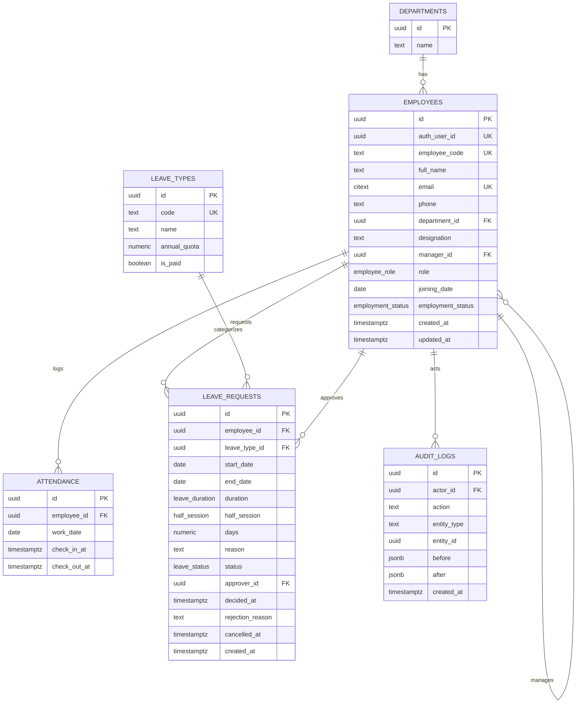

> Status: Draft — pending human approval before `supabase db push`   ·   Last updated: 2026-09-15 18:00 IST   ·   Owner: Ankush
> Related: docs/BUSINESS_RULES.md, docs/DECISIONS.md ADR-005, ADR-006, ADR-011, ADR-013, ADR-014

# Database design

**This SQL is a design, not an executed migration.** No Supabase project has been created and no migration has been run. A human runs `supabase db push` after reviewing this file.

## ER diagram



## DDL design

```sql
-- Extensions
create extension if not exists citext;
create extension if not exists btree_gist;

-- Enums
create type employee_role as enum ('admin', 'manager', 'employee');
create type employment_status as enum ('active', 'inactive');
create type leave_status as enum ('pending', 'approved', 'rejected', 'cancelled');
create type leave_duration as enum ('full_day', 'half_day');
create type half_session as enum ('first_half', 'second_half');

-- departments
create table departments (
  id uuid primary key default gen_random_uuid(),
  name text not null unique
);

-- employees
create table employees (
  id uuid primary key default gen_random_uuid(),
  auth_user_id uuid unique,                -- null until a login account is provisioned
  employee_code text not null unique,      -- app-generated: EMP-0001, immutable (BR-21)
  full_name text not null,
  email citext not null unique,            -- case-insensitive (BR-21)
  phone text,
  department_id uuid references departments(id),
  designation text,
  manager_id uuid references employees(id),
  role employee_role not null default 'employee',
  joining_date date not null,
  employment_status employment_status not null default 'active',
  created_at timestamptz not null default now(),
  updated_at timestamptz not null default now(),
  constraint manager_not_self check (manager_id is null or manager_id <> id),
  constraint joining_date_not_too_future check (joining_date <= (now() at time zone 'Asia/Kolkata')::date + interval '90 days')
);
create index employees_manager_id_idx on employees(manager_id);
create index employees_department_id_idx on employees(department_id);

-- attendance
create table attendance (
  id uuid primary key default gen_random_uuid(),
  employee_id uuid not null references employees(id),
  work_date date not null,
  check_in_at timestamptz not null,
  check_out_at timestamptz,
  constraint attendance_unique_per_day unique (employee_id, work_date),
  constraint checkout_after_checkin check (check_out_at is null or check_out_at > check_in_at)
);
create index attendance_work_date_idx on attendance(work_date);

-- leave_types
create table leave_types (
  id uuid primary key default gen_random_uuid(),
  code text not null unique,
  name text not null,
  annual_quota numeric(4,1),   -- null = no quota (Unpaid)
  is_paid boolean not null default true
);

-- leave_requests
create table leave_requests (
  id uuid primary key default gen_random_uuid(),
  employee_id uuid not null references employees(id),
  leave_type_id uuid not null references leave_types(id),
  start_date date not null,
  end_date date not null,
  duration leave_duration not null default 'full_day',
  half_session half_session,
  days numeric(4,1) not null,
  reason text not null,
  status leave_status not null default 'pending',
  approver_id uuid references employees(id),
  decided_at timestamptz,
  rejection_reason text,
  cancelled_at timestamptz,
  created_at timestamptz not null default now(),
  constraint end_after_start check (end_date >= start_date),
  constraint half_day_single_date check (duration <> 'half_day' or start_date = end_date),
  constraint half_day_needs_session check (duration <> 'half_day' or half_session is not null),
  constraint reason_length check (char_length(reason) between 10 and 500),
  constraint rejection_reason_length check (rejection_reason is null or char_length(rejection_reason) between 10 and 500),
  constraint approver_not_self check (approver_id is null or approver_id <> employee_id),
  -- BR-02: no overlapping pending/approved leave for the same employee
  exclude using gist (
    employee_id with =,
    daterange(start_date, end_date, '[]') with &&
  ) where (status in ('pending', 'approved'))
);
create index leave_requests_status_employee_idx on leave_requests(status, employee_id);

-- audit_logs
create table audit_logs (
  id uuid primary key default gen_random_uuid(),
  actor_id uuid references employees(id),
  action text not null,
  entity_type text not null,
  entity_id uuid,
  before jsonb,
  after jsonb,
  created_at timestamptz not null default now()
);
create index audit_logs_entity_idx on audit_logs(entity_type, entity_id);

-- updated_at trigger
create or replace function set_updated_at() returns trigger as $$
begin
  new.updated_at = now();
  return new;
end;
$$ language plpgsql;

create trigger employees_set_updated_at
  before update on employees
  for each row execute function set_updated_at();

-- RLS: enabled everywhere, zero policies (ADR-005) — deny-all for anon/authenticated Postgres roles.
-- The server connects with the privileged pooler connection string, so these do not affect server queries.
alter table departments enable row level security;
alter table employees enable row level security;
alter table attendance enable row level security;
alter table leave_types enable row level security;
alter table leave_requests enable row level security;
alter table audit_logs enable row level security;
```

## Indexes justified by query

| Index | Query it serves |
|---|---|
| `employees(manager_id)` | "my direct reports" scope lookup (ADR-013), every manager-scoped query |
| `employees(department_id)` | employee list filter by department (FR-EMP-01) |
| `attendance(work_date)` | "who's present today" dashboard queries, date-range history |
| `leave_requests(status, employee_id)` | approvals queue filtering, "my requests" |
| `audit_logs(entity_type, entity_id)` | audit log lookup by resource |

## Constraint → business rule mapping

| Constraint | BR |
|---|---|
| `attendance_unique_per_day` | BR-14 |
| `checkout_after_checkin` | BR-16 |
| leave_requests exclusion constraint | BR-02 |
| `end_after_start` | BR-01 |
| `half_day_single_date`, `half_day_needs_session` | BR-05 |
| `reason_length`, `rejection_reason_length` | BR-09 |
| `approver_not_self` | BR-10 |
| `employees.email` (citext unique) | BR-21 |
| `manager_not_self` | BR-23 (cycle detection itself is enforced in the API — a DB check can't detect multi-hop cycles) |
| `joining_date_not_too_future` | BR-26 |

## Seed plan

- 4 departments.
- 2 HR/Admin: `hr@stafy.app` (no manager) and a second HR/Admin who **reports to a manager** (per ADR-009, so HR-leave-approved-by-manager path is exercised).
- 2 Managers: `manager@stafy.app` (Team A), `manager.b@stafy.app` (Team B).
- 4 employees per team (8 total), including `employee@stafy.app` (Team A).
- 1 inactive employee (to exercise BR-24/deactivated-user paths).
- ~20 working days of realistic attendance history mixing: present, half-day, missed-checkout (`missedCheckout: true`), absent.
- Leave requests in every status (`pending`, `approved`, `rejected`, `cancelled`), including at least one cross-team pair (to prove a Team B manager cannot see/act on Team A's request).
- All demo passwords come from the `DEMO_PASSWORD` env var — never hardcoded in seed source.

| Demo account | Email | Role | Team |
|---|---|---|---|
| HR/Admin (no manager) | `hr@stafy.app` | admin | — |
| Manager, Team A | `manager@stafy.app` | manager | A |
| Manager, Team B | `manager.b@stafy.app` | manager | B |
| Employee, Team A | `employee@stafy.app` | employee | A |

`npm run seed` populates this data; `npm run seed:reset` restores it (ADR-023). Both are stubs until P1.
