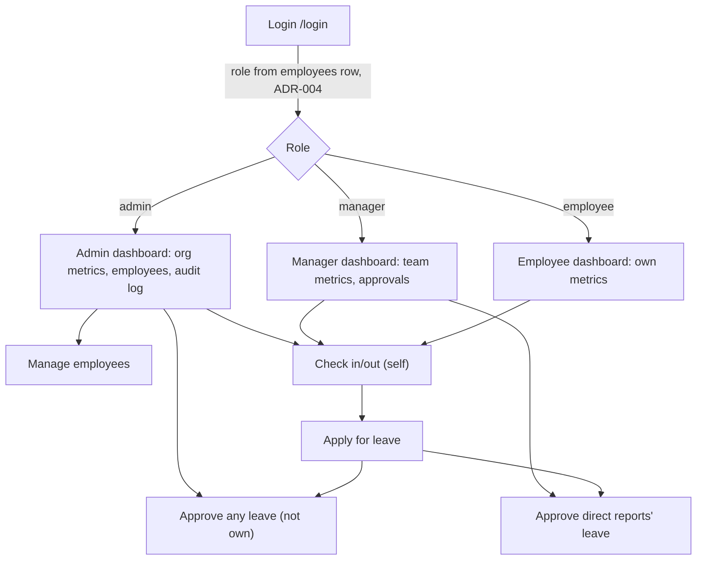

> Status: Draft   ·   Last updated: 2026-09-15 18:00 IST   ·   Owner: Ankush
> Related: docs/PRD.md, docs/ARCHITECTURE.md, docs/DATABASE.md, docs/DECISIONS.md

# Planning document (submission deliverable)

## Requirement breakdown

| Module | Summary | Detail |
|---|---|---|
| Auth | Login/logout/refresh via Supabase Auth, server-issued `HttpOnly` cookies | `docs/ARCHITECTURE.md` API contract, ADR-003 |
| Employees | HR-managed CRUD + self-profile, role/status guarded | `docs/PRD.md` FR-EMP-*, BR-21…26 |
| Attendance | Self check-in/out, derived daily status, scoped history views | `docs/PRD.md` FR-ATT-*, BR-14…20, ADR-011 |
| Leave | Apply/cancel/approve with computed balance and single-approver routing | `docs/PRD.md` FR-LV-*, BR-01…13, ADR-009, ADR-014 |
| Dashboard | Role-shaped live metrics | `docs/PRD.md` FR-DASH-*, Dashboard metric definitions |

## Application flow

## Database design summary

Postgres via Supabase. `employees` is the single identity table (role = permission level, ADR-013); `attendance` and `leave_requests` reference it. Attendance status and leave balance are **computed at read time**, never stored (ADR-011, ADR-014). Correctness-critical rules are enforced twice — once as a Postgres constraint, once in the API service layer — see `docs/DATABASE.md` constraint → BR mapping table.

## Technology selection (why)

| Choice | Why |
|---|---|
| React + Vite, JavaScript (no TS) | Fastest iteration for a solo one-day build; risk mitigated with Zod at every boundary (ADR-001) |
| Express 5 on Vercel Functions, same origin as the client | Removes CORS and cross-site cookie complexity entirely (ADR-002) |
| Supabase (Postgres + Auth) | Managed Postgres with real constraints/transactions, managed auth without owning password storage (ADR-001, ADR-003) |
| `pg` + raw parameterized SQL, no query builder | BR-04/BR-12/BR-13 need real multi-statement transactions; the supabase-js builder doesn't support them (ADR-006) |
| RLS enabled, zero policies | Cheap defense against a leaked client key without duplicating every business rule as a second policy layer under a one-day timebox (ADR-005) |

## Assumptions

- Working days are Monday–Friday; public holidays are out of scope (ADR-011).
- A Manager's team is direct reports only, no recursive org chart (ADR-013).
- Leave approval is single-approver via `manager_id` routing, not multi-approver (ADR-009).
- Demo credentials are intentionally public for evaluator access (`docs/SECURITY.md`).
